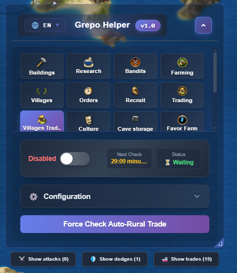
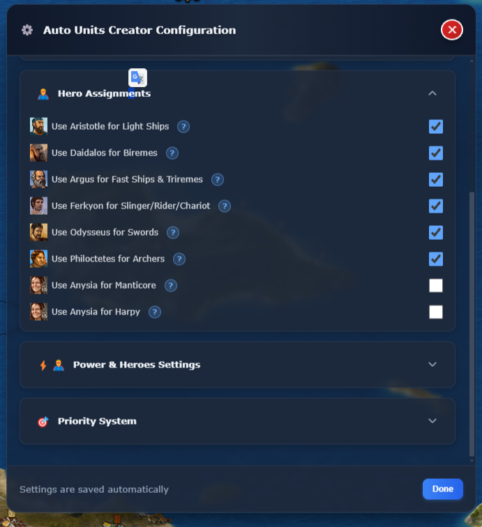
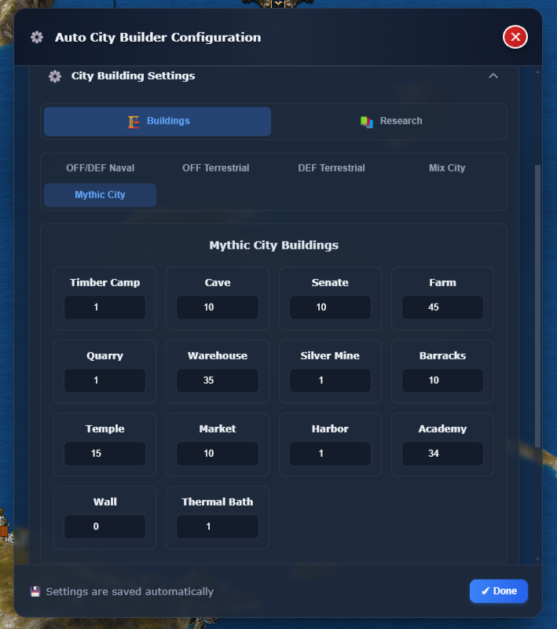
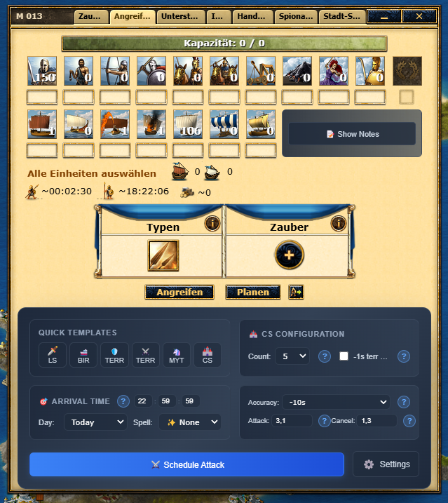

# 🏛️ GrepoHelper - Advanced Grepolis Bot

**The #1 Grepolis Bot for Strategic Domination**

[Website](https://www.grepohelper.com) • [Discord](https://discord.gg/sH27AumNPD) • [Features](#-features) • [Documentation](#-documentation) • [Support](#-support)

---

## 🎯 Overview

GrepoHelper is the #1 premium **Grepolis bot** automation platform designed for Grepolis players seeking to optimize their gameplay through intelligent automation. This advanced **Grepolis automation bot** features 22+ powerful automation tools covering city building, military coordination, resource management, and strategic warfare. Transform your Grepolis experience with the best **Grepolis bot** available.

### ✨ Key Highlights

- 🤖 **22+ Automation Features** - Complete **Grepolis bot** automation suite for all aspects of gameplay
- 🌍 **Multi-Language Support** - Available in 9 languages (EN, DE, ES, FR, IT, PL, HU, PT, RO, EL)
- 🏙️ **Multi-City Management** - Seamlessly manage unlimited cities with this powerful **Grepolis bot**
- 🛡️ **Advanced Safety Systems** - Human activity detection, captcha handling, and intelligent pause mechanisms
- 📊 **Real-Time Analytics** - Comprehensive monitoring and performance tracking
- 🔔 **Discord/Telegram Integration** - Real-time notifications for critical events
- 💳 **Multiple Payment Options** - Stripe and cryptocurrency (NOWPayments) support

---

## 🚀 Features

### 🏗️ Buildings & Infrastructure
- **Auto-Build** - Smart construction queue management with resource validation
- **Auto City Builder** - Apply perfect city templates to 100+ cities instantly
- **Auto-Research** - Continuous Academy advancement automation
- **Auto-Recruit** - Optimized unit production management
- **Auto-Culture** - Maximize culture points automatically

### ⚔️ Combat & Military
- **Attack Planner** - Advanced coordination system for complex attack strategies
- **Auto CS Destroyer** - Automatic Colony Ship detection and destruction
- **Bandit Camp** - Automated bandit attacks with smart unit management
- **Auto Dodge** - Intelligent defensive evasion system
- **Auto Units Creator** - Advanced army building algorithms
- **Auto Favor Farm** - Automated favor farming with Harpy/Manticore
- **Auto Farm BP** - Battle points farming optimization

### 💰 Resource Management
- **Auto Farm** - Smart village resource collection with human-like patterns
- **Auto Village Upgrade** - Automatic village development and unlocking
- **Auto Trade** - Intelligent inter-city resource balancing
- **Auto Village Trading** - Specialized village trade optimization
- **Auto Silver Cave** - Automatic silver storage management
- **Auto Complete Orders** - Free instant builds under 5 minutes

### 🛠️ System & Utilities
- **Human Activity Detection** - Smart pause system when you're actively playing
- **Night Pause** - Intelligent scheduling for natural gameplay patterns
- **Queue Monitor** - Real-time dashboard for all bot operations
- **Discord/Telegram Notifications** - Real-time alerts for critical events

---

## 📊 Statistics

| Metric | Value |
|--------|-------|
| 👥 **Active Players** | 500+ |
| 🔧 **Automation Features** | 22+ |
| 🛡️ **Safety Features** | 100% Safe & Undetected |
| 🌍 **Languages Supported** | 9 |
| ⏱️ **Time Saved Daily** | 5+ Hours |
| 📈 **Resource Efficiency** | +250% |

---

---

## 🚀 Getting Started

Visit [www.grepohelper.com](https://www.grepohelper.com) to get started with GrepoHelper, the best **Grepolis bot** available. Sign up for a free trial and experience the power of advanced **Grepolis automation** with our premium **Grepolis bot** features.

---

## 📚 Documentation

For complete feature documentation, guides, and more information, visit our website:

**[📖 View Complete Features Documentation](https://grepohelper.com/en/features)**

---

## 🎨 Screenshots

> 📸 More screenshots available in the [screenshots](./screenshots/) directory

---

## 💡 Key Benefits

### 🤖 Intelligent Automation
- Smart resource validation before actions
- Queue optimization and duplicate prevention
- Randomized timing for natural gameplay patterns
- Population and capacity management

### 🏙️ Multi-City Support
- Seamlessly operate across all your cities with this powerful **Grepolis bot**
- Centralized management interface
- City-specific configurations and strategies

### 🛡️ Safety Features
- Captcha detection and handling
- Discord notifications for critical events
- Automatic pause during suspicious activity
- Respect for game mechanics and limitations - **Grepolis bot** stays undetected

### 🎯 User Experience
- Intuitive React-based interface
- Persistent settings and configurations
- Real-time status monitoring
- Comprehensive customization options

---

## 🌍 Supported Languages

This **Grepolis automation bot** supports 9 languages for players worldwide:

- 🇬🇧 English (EN)
- 🇩🇪 German (DE)
- 🇪🇸 Spanish (ES)
- 🇫🇷 French (FR)
- 🇮🇹 Italian (IT)
- 🇵🇱 Polish (PL)
- 🇭🇺 Hungarian (HU)
- 🇵🇹 Portuguese (PT)
- 🇷🇴 Romanian (RO)
- 🇬🇷 Greek (EL)

---

## 🤝 Support

- 💬 **Discord** - [Join our Discord](https://discord.gg/sH27AumNPD)
- 🌐 **Website** - [www.grepohelper.com](https://www.grepohelper.com)

---

## 📝 License

This project is proprietary software. All rights reserved.

© 2025 GrepoHelper. All rights reserved.

---

## 🙏 Acknowledgments

Built with modern web technologies and best practices to deliver the best possible experience for Grepolis players. The **#1 Grepolis bot** trusted by 500+ players worldwide.

---

**Made with ❤️ for the Grepolis community**

[⭐ Star this repo](https://github.com/yourusername/grepohelper) • [🐛 Report Bug](https://github.com/yourusername/grepohelper/issues) • [💡 Request Feature](https://github.com/yourusername/grepohelper/issues)

